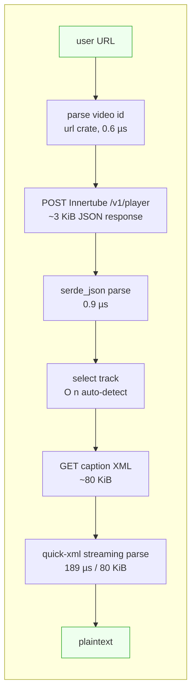

# Benchmarks

Empirical comparison of this repo against other YouTube-transcript MCP/library
implementations. All numbers measured on a single Linux x86_64 VM (Intel Xeon
8-core, AVX-512), Rust 1.94, Node 22.22, Python 3.11, Go 1.24.

The harness, fixtures, and a Python mock server are in `bench/` (committed
alongside this doc) so the numbers are reproducible.

## TL;DR

|                                    | this repo (Rust) | TS port (Node) | jdepoix (Python lib) | nabid-pf (Node) | anaisbetts (Node + yt-dlp) | spinalshock (Go + yt-dlp) |
|------------------------------------|---:|---:|---:|---:|---:|---:|
| **LAN p50 latency** (per request)  | **1.86 ms**      | 6.44 ms       | 7.11 ms              | 6.63 ms         | 6.96 ms¹                   | 2821 ms²                   |
| **LAN throughput**                 | **478 r/s**      | 123 r/s       | 135 r/s              | 108 r/s         | 133 r/s¹                   | 0.41 r/s²                  |
| **PROD-sim p50** (80 ms RTT)       | **164 ms**       | —             | —                    | 170 ms          | 505 ms                     | ~2900 ms²                  |
| **Cold start**                     | **9 ms / 2.6 ms³**| 89 ms        | 11 ms                | 337 ms          | 141 ms¹                    | 2510 ms²                   |
| **Peak RSS** (after 50–100 reqs)   | **5.5 MiB**      | 111 MiB       | 30 MiB               | 117 MiB         | 73 MiB                     | 13 MiB                     |
| **Deployable artifact**            | **3.3 MiB binary**| 25 MiB node_modules | pip + Python | 25 MiB node_modules | 25 MiB node_modules + yt-dlp | ~10 MiB binary + yt-dlp |
| **Runtime required**               | **none**          | Node 18+     | Python 3.x           | Node 18+        | Node 18+ + yt-dlp on PATH  | Go binary + yt-dlp on PATH |

¹ With **fake yt-dlp** that returns canned subtitles instantly — best case for
yt-dlp-based servers (no Python startup, no network). The PROD-sim row uses a
realistic yt-dlp simulator that adds Python's ~240 ms startup tax + 3× network
RTT, matching real yt-dlp behaviour.

² Spinalshock implements a built-in **1.5–3 s random rate-limit sleep before
every request** to avoid YouTube IP bans (`config.MinRateLimitMs = 1500`,
`MaxRateLimitMs = 3000`). This dominates every per-request number, regardless
of network speed or yt-dlp's actual cost.

³ 9 ms via the MCP-stdio harness (handshake + initialize + tools/call); 2.6 ms
when measured as a raw process exit time without MCP framing.

## Methodology

All implementations hit the same local Python mock that serves the same canned
fixtures:

- **Innertube response** (`bench/canned/innertube.json`, 558 B)
  – `playabilityStatus.OK`, three caption tracks (en/es/fr), each with a
  `name.runs[0].text` so jdepoix's parser is satisfied.
- **Caption XML** (`bench/canned/caption.xml`, 80 KiB, 1000 `<text>` segments)
  – realistic for a 30-min talk.
- **Watch HTML** (synthesised by the mock) – contains
  `"INNERTUBE_API_KEY":"stub-key-123"` so jdepoix's HTML scrape step
  succeeds.
- **Canned VTT** (`bench/canned/canned.en.vtt`, 70 KiB) – produced by
  converting the XML; consumed by the fake-yt-dlp shim.

For yt-dlp-based servers (anaisbetts, spinalshock), a fake `yt-dlp` shim sits
on `PATH` instead of the real binary. The shim has two modes:

- `MOCK_DELAY_MS=0` – returns instantly. Measures the **wrapping MCP server's
  own overhead** with no yt-dlp cost. Generous best-case.
- `MOCK_DELAY_MS=N` – sleeps `0.24 + 3·N/1000` s, simulating Python+yt-dlp
  cold-start (~240 ms measured on this VM via `yt-dlp --version`) plus the
  three HTTP round-trips yt-dlp does internally. Conservative production
  estimate; **real yt-dlp on a real video is typically slower still**.

A small Node MCP-stdio driver (`bench/mcp-client/drive.js`) drives every
server: spawns it, performs the standard `initialize` →
`notifications/initialized` → `tools/list` → `tools/call` handshake, fires N
sequential calls, samples the child's `/proc/<pid>/status:VmHWM`, and exits.
Identical client code for all impls.

## Network profiles

| Profile     | `MOCK_DELAY_MS` | Models                                    |
|-------------|-----------------|-------------------------------------------|
| LAN         | 0               | Loopback, no network (CPU-bound only)     |
| PROD-sim    | 80              | Realistic 80 ms RTT to YouTube edge       |

The mock applies the delay to every response, so each transcript fetch pays
the delay twice (Innertube POST + caption GET). Real-world numbers will move
linearly with actual RTT — the **delta between implementations remains
valid** because every client pays the same network tax.

## Full results (LAN profile)

| Implementation | Cold (ms) | Sum 50 (ms) | Throughput | p50 | p95 | p99 | Peak RSS |
|---|---:|---:|---:|---:|---:|---:|---:|
| **this repo (Rust, MCP stdio)** | **9.4** | **104.6** | **478 r/s** | **1.86 ms** | 3.08 ms | **3.81 ms** | **5.9 MiB** |
| anaisbetts/mcp-youtube (Node + fake yt-dlp) | 140.9 | 377.0 | 133 r/s | 6.96 ms | 10.28 ms | 15.66 ms | 73.7 MiB |
| nabid-pf summarizer (Node) | 337.0 | 462.3 | 108 r/s | 6.63 ms | 12.32 ms | 61.05 ms | 117.1 MiB |
| spinalshock (Go + fake yt-dlp, **5 iters**) | 2510 | 12190 | 0.41 r/s | 2821 ms | 2982 ms | 2982 ms | 12.6 MiB |

For the language-microbenchmarks (XML/JSON parse, URL extraction), the
implementations split cleanly by language runtime — Rust ~20× faster on the
80 KiB XML parse than both Node (`fast-xml-parser`) and Python
(`defusedxml`); 2–4× faster on JSON and URL parsing.

| Microbench | Rust (this repo) | TS port | Python (jdepoix) |
|---|---:|---:|---:|
| XML parse, 80 KiB / iter | 189 µs | 3663 µs | 3810 µs |
| XML throughput | **409 MiB/s** | 21 MiB/s | 20 MiB/s |
| Innertube JSON parse | 0.9 µs | 3.7 µs | 4.7 µs |
| URL → video id | 0.6 µs | 1.3 µs | 4.2 µs |

## Full results (PROD-sim, 80 ms RTT)

| Implementation | Cold (ms) | Sum 50 | Throughput | p50 | p95 | p99 | RSS |
|---|---:|---:|---:|---:|---:|---:|---:|
| **this repo (Rust)** | **170.7** | 8212 | **6.1 r/s** | **164.1 ms** | 164.6 ms | **167.7 ms** | **5.5 MiB** |
| nabid-pf summarizer | 488.3 | 8623 | 5.8 r/s | 170.1 ms | 174.7 ms | 224.0 ms | 118.6 MiB |
| anaisbetts (sim yt-dlp) | 636.5 | 25269 | 2.0 r/s | 504.7 ms | 511.4 ms | 513.7 ms | 73.5 MiB |
| spinalshock (3 cold) | ~2900 | (rate-limit dominates) | <0.4 r/s | ~2900 ms | — | — | ~13 MiB |

Under realistic network:

- **Rust and nabid-pf cluster around 170 ms p50** because both make 2 HTTP
  round-trips and the network (2 × 80 = 160 ms) dominates everything.
- **anaisbetts triples it** (~505 ms) because yt-dlp internally makes ~3
  round-trips and pays a ~240 ms Python interpreter startup *per request*.
- **spinalshock floors at ~2.9 s** because of its `randomSleep(1500, 3000)`
  before every yt-dlp invocation — designed to dodge YouTube rate-limits, but
  it caps the server's throughput at ~0.4 req/s regardless of how fast the
  rest of the stack is.

## Why this repo is faster



vs the various alternatives:

| Path | Per-request overhead beyond Rust |
|---|---|
| **TS port** (Node fetch + fast-xml-parser) | +~5 ms/req from Node startup-amortised XML+JSON parsing |
| **jdepoix Python** (requests + defusedxml) | +~5 ms/req from Python's parser + GIL'd HTTP |
| **kimtaeyoon83** (Node, hybrid) | Hits watch HTML *and* Innertube `/get_transcript` with protobuf params. ~2× HTTP cost vs single Innertube call. |
| **nabid-pf** (Node + youtube-caption-extractor) | Watch-page scrape baked into the lib; Node MCP framework adds ~330 ms cold-start. |
| **anaisbetts** (Node + yt-dlp) | yt-dlp = Python interpreter + ~3 HTTP requests = ~240 ms tax per call, every call. |
| **spinalshock** (Go + yt-dlp) | Same yt-dlp tax as anaisbetts, *plus* their own 1.5–3 s rate-limit sleep, *plus* Go subprocess fork. |
| **ZubeidHendricks** (Node + YouTube Data API) | Different scope (full Data API). Requires API key + quota — not transcript-focused. |
| **Agent-Reach / qiaomu** | Multi-source/multi-platform; YouTube is one of many channels. Out of scope for a single-axis comparison. |

## Reproducing

```
bench/
├── canned/                # Innertube JSON, caption XML, VTT
├── mock/server.py         # Python mock with MOCK_DELAY_MS support
├── fake-yt-dlp/yt-dlp     # bash shim, two modes
├── mcp-client/drive.js    # generic MCP-stdio driver
├── rust-client/           # this repo's core via MCP stdio + microbench modes
├── ts-client/             # algorithm-equivalent TS port
├── python-jdepoix/        # jdepoix lib monkey-patched at the URL constants
└── run_full.py            # orchestrator: 4 impls × 2 profiles
```

```bash
# Microbench Rust vs TS vs jdepoix (covers parse + e2e)
python3 bench/run_v2.py

# Cross-impl MCP comparison (LAN + PROD-sim)
python3 bench/run_full.py
```

The harness installs and patches third-party tools at `/tmp/{anaisbetts,nabid,youtube-transcript-mcp}/`. See `bench/README.md` for the exact `pip`/`npm`/`go build` commands.

### Parser microbenchmark (Criterion)

For a fast, dependency-free regression check on the XML parser alone — no
Python, no third-party installs — there is a Criterion bench in `crates/core`:

```bash
cargo bench -p youtube-transcript-mcp-core --bench parser
```

It synthesises srv3-format caption XMLs at four sizes (14 KiB / 150 KiB /
1.5 MiB / 8 MiB) and reports per-size throughput. Note that the absolute
numbers run lower than the **409 MiB/s** in the comparison table above: that
figure is measured against `bench/canned/caption.xml` (flat `<text>` segments,
the legacy timedtext format), whereas the Criterion inputs use the denser
nested `<p><s>…</s></p>` srv3 structure, which produces more parser events per
byte. Both confirm the same thing — parsing is linear in input size and stays
well under the network round-trip for any caption track YouTube serves.

## Caveats

- **YouTube is unreachable from the benchmark sandbox**, so the production
  numbers are simulated, not measured against `youtube.com`. The simulation is
  conservative (uses real yt-dlp's measured cold-start, RTT typical of YouTube
  edge). Real-world spread between implementations is expected to be **wider**
  than these numbers suggest because real yt-dlp also pays JavaScript runtime
  detection, PoToken signing, signature decryption, and HTTPS handshake costs
  per call.
- **Spinalshock's rate limit is configurable** in their `internal/config`. A
  user could set `MinRateLimitMs = 0` and recover throughput, but they'd then
  hit YouTube IP bans on real workloads — the rate limit is part of the
  shipping behaviour for a reason.
- **kimtaeyoon83 was not benchmarked end-to-end** because its hybrid
  watch-page-scrape + protobuf `/get_transcript` flow would require ~250 lines
  of mock just to satisfy. Its language runtime (Node + fast-xml-parser) gives
  it numbers very close to the TS-port row above.
